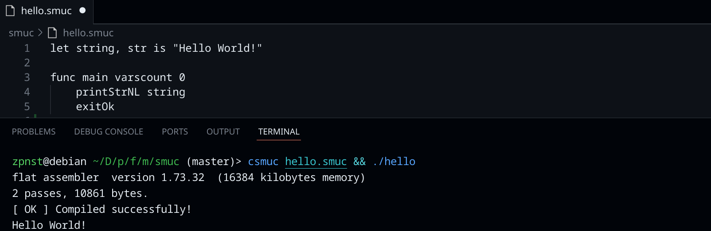
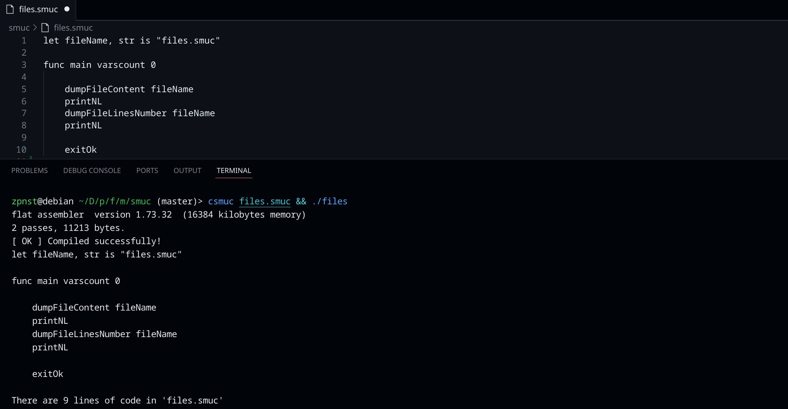
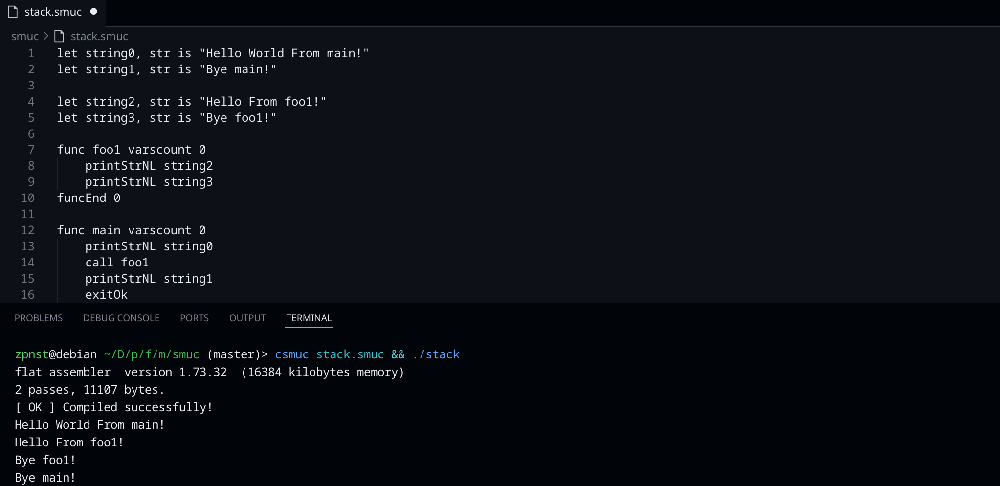

# macrolang

## DISCLAIMER

This code was written solely for fun.

## fasm macro

Macros in fasm are a great tool for writing code. To read more about macros and, in general, about the capabilities of flat assembly, follow this link

## csmuc linker

All the linker does is create a file in its virtual address space into which it writes the fasm macro definitions first, followed by the silly macrolang program code and compiles it with the fasm command <(0_0)>

## examples

### Here are some simple examples:

#### "Hello, World!"

Hello, World!



#### Working with files

This program reads a file with its own code and outputs its contents and the number of lines to the terminal.



#### Function calls

A simple function calls chain




The rest of the examples are in the .smuc directory.

## setting up csmuc

These commands will help you add the executable file of the csmuc 'linker' to the standard linux directory /usr/local/bin so that the command shell can find this name
```
git clone git@github.com:zpnst/macrolang.git
cd macrolang
sudo chmod +x ./make.sh
sudo ./make.sh
```